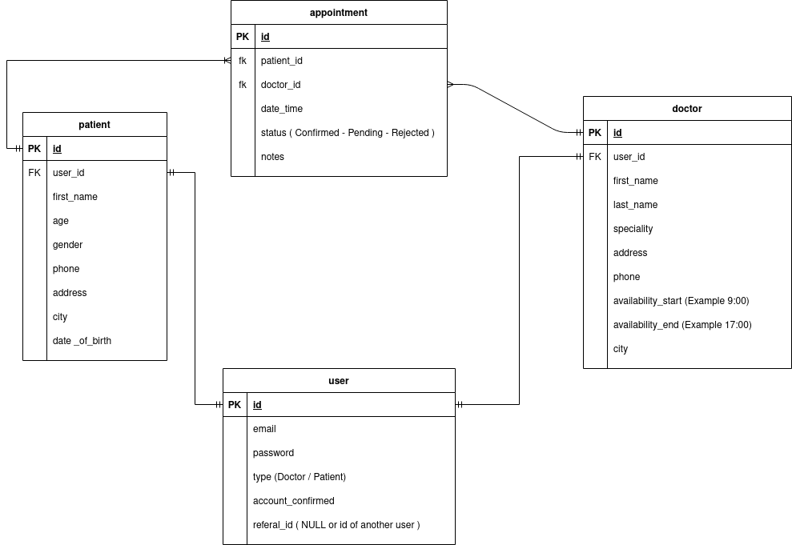
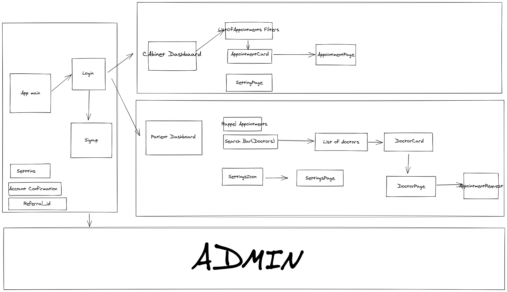

# Doctor and Patients Appointment Managment System

## TODO

- Doctor Controller : Chedly

  - [ ] GET /api/doctor/{doctorId}/appointments
  - [ ] POST /api/doctor/{doctorID}/appointments
  - [ ] GET /api/doctor/{doctorID}/appointments/{appointmentID}
  - [ ] PUT /api/doctor/{doctorID}/appointments/{appointmentID} // Status - Date - Time - Notes
  - [ ] PUT /api/doctors/{doctorId}
  - [ ] Exceptions + Handler

- Patients Controller : Mouwahed

  - [ ] GET /api/patients/{patientId}/appointments
  - [ ] POST /api/patients/{patientId}/appointments
  - [ ] GET /api/patients/{patientId}/appointments/{appointmentID}
  - [ ] PUT /api/patients/{patientId}
  - [ ] Exceptions + Handler

- User Auth ESLEM (https://javatodev.com/spring-boot-jwt-authentication/) :

  - [ ] Add Spring Security
  - [ ] ReferralID (https://www.baeldung.com/spring-request-param)
  - [ ] User Confirmation
  - [ ] JWT -

- Aspects :
  - [] Logging Aspect

## User stories and features

- A user can create and manage his account, he can refer other users to sign up in order to obtain special offers/gifts.
- A user has to confirm his account in order to obtain full functionality access.
- A user can be a Doctor or a Patient.

### Doctors

A **Doctor**, in addition to his normal user abilities, can :

1. Create/Read/Update/Delete(Cancel) an appointment.
2. Checkout patients that have already had an appointment with him.
3. Accept or reject appointments requested by a patient.
4. List future appointments in a calendar.
5. Update his contact information.

### Patients

A **Patient**, in addition to his normal user abilities, can :

1. List all Doctors affiliated with this service and sort them by city/speciality...
2. Request an appointment with any doctor.
3. List his history of Appointments with any doctor.
4. List future appointments in a calendar.
5. Update his contact information.

## Entity Relationship Model

[ER Diagram Link](https://drive.google.com/file/d/1DUD2y6Z2Ej43MxXln2_BN-1rasQEu8Ne/view?ts=602ae58a)

## Front-end flow

